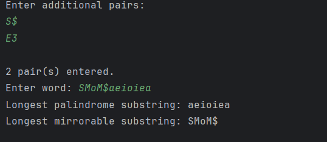
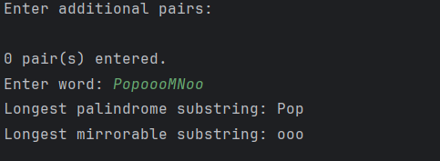

### Problem Description
You are required to write a Java program that analyzes a word entered  by the user to find:

1.Longest palindrome substring
2.Longest mirrorable substring

A mirrorable string is defined as a string that looks the same when reflected in a mirror, meaning each character has a valid mirror
pair while a palindrome string is a word that reads the same forwards and backwards.
The program comes with a list of default mirror pairs. The user can also add up to 10 new mirror pairs before testing their input word. Minimum length for the valid palindrome and mirrorable substring is 2.
If the string contains multiple longest palindrome substrings or longest mirrorable substrings of the same length, display the first one that appears in the string.

Your program should:
1. Allow the user to input additional mirror pairs,where each pair consists of exactly two characters.
2. The user may stop entering pairs by pressing Enter on an empty line.
3. Each valid pair should automatically include its reverse form
4. Read a string from the user.
5. Determine and display :

    a. Longest palindrome substring in the string
    b. Longest mirrorable substring in the string
6. If there are multiple longest palindrome and mirrorable substring in the string, display the first one.
7. Display "-" if no palindrome or mirrorable substring exists.

You must implement the following methods:
1. String getLongestPalindrome(String str)
2. String getLongestMirrorWord(String str)

Default Mirror Pairs (19):
A and A, H and H, b and d, p and q, etc

* You may create and use any additional helper methods if necessary
* You are not allowed to use ArrayList, HashSet, or any other advanced Java collection classes.

Input:
Enter up to 10 lines of mirror pairs, each containing two characters seperated by a space, an empty line indicates the end of mirror pair input.Then one additional line containing the word to analyze.

Output:
Print the longest palindrome and mirrorable substring in the given string. Display "-" if none are found.

### Solution Explanation
**1. Data Structure**

* `mirrorLeft` and `mirrorRight` store mirror pairs
* `mirrorCount`tracks how many mirror pairs are currently stored.

**2. Initialize Default Mirror Pairs**

`char[] L = {'A','H','I','M','O','T','U','V','W','X','Y','o','u','v','w','b','d','p','q'};
   char[] R = {'A','H','I','M','O','T','U','V','W','X','Y','o','u','v','w','d','b','q','p'};`
* Each character in `L` maps to the corresponding character in `R`.

Example: `'b' -> 'd', 'p' -> 'q'`, uppercase letters like `'A'`can mirror themselves.
`for (int i = 0; i < L.length; i++) {
mirrorLeft[i] = L[i];
mirrorRight[i] = R[i];
mirrorCount++;
}`
* Stores these default mirror pairs in the arrays.

**3. User Input for Additional Mirror Pairs**
`for (int i = 0; i < 10; i++) {
    String line = sc.nextLine();
    if (line.length() == 0) break;
    if (line.length() == 2) {
        addMirrorPair(line.charAt(0), line.charAt(1));
    }
}
`
* The user can input up to 10 extra mirror pairs, 2 characters at a time (e.g., "bd").

* Empty input stops reading.

 `addMirrorPair` method:
`static void addMirrorPair(char left, char right) {
    if (mirrorCount < mirrorLeft.length) {
        mirrorLeft[mirrorCount] = left;
        mirrorRight[mirrorCount] = right;
        mirrorCount++;
    }
}`
*Adds the new mirror pair to the arrays and updates the count.

**4. Check Mirror Pairs**
`static boolean isMirror(char a, char b) {
    for (int i = 0; i < mirrorCount; i++) {
        if (mirrorLeft[i] == a && mirrorRight[i] == b) return true;
    }
    return false;
}`
* Loops through all mirror pairs and returns `true` if` (a,b)` exists.

* Used later to detect mirrorable substrings.

**5. Find Longest Palindrome**
`for (int i = 0; i < n; i++) {
    int len1 = expandPalindrome(s, i, i);
    int len2 = expandPalindrome(s, i, i + 1);
    int len = Math.max(len1, len2);
    if (len > maxLen) {
        maxLen = len;
        start = i - (len - 1) / 2;
    }
}`

**Center expansion method:**

* For each character` i`:

    * Odd-length palindrome: `expandPalindrome(s, i, i)`

    * Even-length palindrome: `expandPalindrome(s, i, i+1)`

* Take the longer one.

* Update `start` and `maxLen` if this palindrome is the longest so far.

`expandPalindrome`:
`static int expandPalindrome(String s, int left, int right) {
    while (left >= 0 && right < s.length() && s.charAt(left) == s.charAt(right)) {
        left--;
        right++;
    }
    return right - left - 1;
}`

* Expands from the center until the characters don’t match.

* Returns the palindrome length.

**6. Find Longest Mirrorable Substring**

Similar logic, but uses `isMirror` instead of equality:
`for (int i = 0; i < n; i++) {
    int len1 = expandMirror(s, i, i);
    int len2 = expandMirror(s, i, i + 1);
    int len = Math.max(len1, len2);
    if (len > maxLen) {
        maxLen = len;
        start = i - (len - 1) / 2;
    }
}`

`expandMirror`:
`static int expandMirror(String s, int left, int right) {
    while (left >= 0 && right < s.length() && isMirror(s.charAt(left), s.charAt(right))) {
        left--;
        right++;
    }
    return right - left - 1;
}`
* Expands from the center while the characters form a mirror pair.

* Returns the mirrorable substring length.

**7. Output**
`System.out.println("Longest Palindrome: " + getLongestPalindrome(input));
System.out.println("Longest Mirrorable: " + getLongestMirrorWord(input));
`
* Prints both the longest palindrome and the longest mirrorable substring.

### Sample input and output
Sample 1

Sample 2

### Source code

See [Q3.java](Q3.java)

