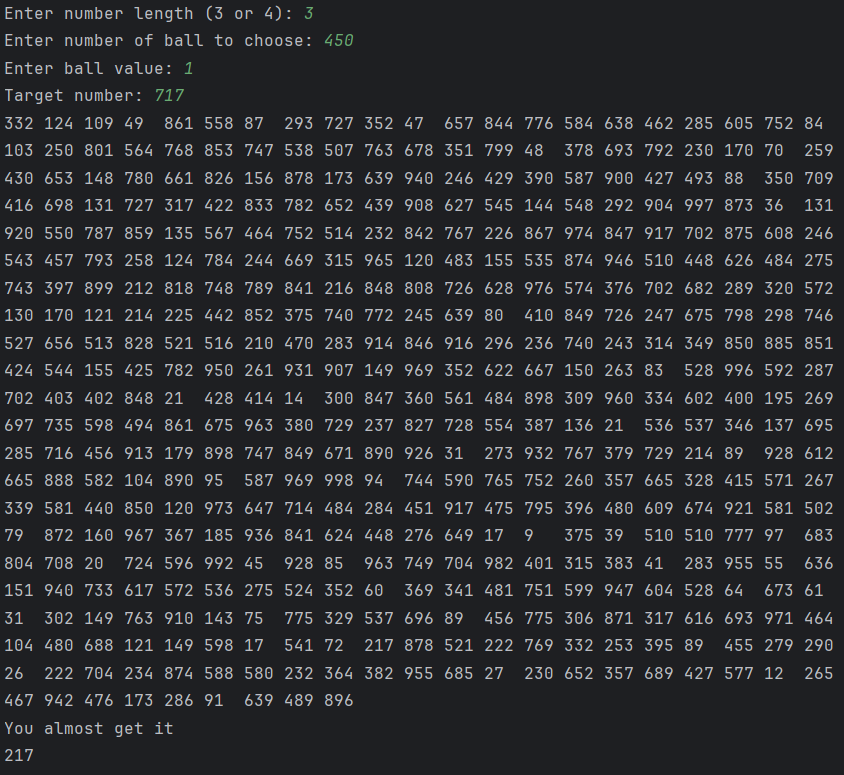
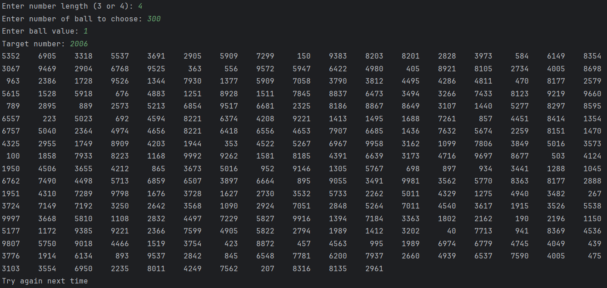

### Problem Description

The task is to develop a text analyzer which can help my grandmother who loves writing letters to her old friends. The program can analyze her letters automatically. The program lets her type her letter line by line and ends when she presses Enter on an empty line. 

It wil then show her: 

- Word count
- Character count
- Character count without space
- Sentence count
- Most frequent word
- Longest word

The program must implement and use the methods and are not allowed to use ArrayList, HashSet, or any other advanced Java collection classes.

### Solution Explanation

The task is solved by using Java with the Scanner class to receive a full line of text. 

After receiving all input, the program processes the text using several methods:

**int wordCount(String str)**: The method counts the number of words by scanning through the entire string character by character and count how many spaces appear. It is done by assuming each space indicates the end of a word.

**int characterCount(String Str)**: The method counts the number of character by directly returning the length of the string.

**int characterCountWithoutSpaces(String str)**: The method loops through all characters annd counts only those that are not a space.

**int sentenceCount(String str)**: A sentence is detected when the string contains punctuations marks such as '.', '?' and '!'. The method loops through all characters and counts the number of these symbols.

**String mostFrequentWord(String str)**: The program determines the most frequent word by splitting the string, sorting the array alphabetically then scanning through the sorted list and counting consecutive duplicates. After the loop ends, the method performs one final check for the last word in case it is the most frequent.

**String longestWord(String str)**: The method splits the string into words and iterates through each word and compares lengths. After that, it will return the longest word found. 

After calling all the above methods, the program prints:

- Word Count
- Character Count
- Character Count without Space
- Sentence Count
- Most Frequent Word
- Longest Word

### Sample Input And Output

Sample 1

Sample 2

### Source code

See [Q4.java](src/TextAnalyzer.java)

