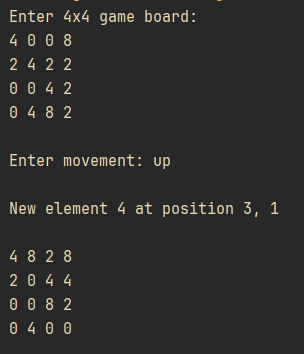
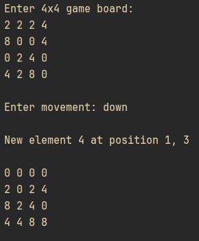
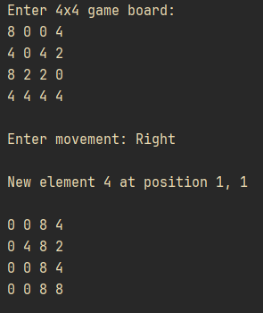
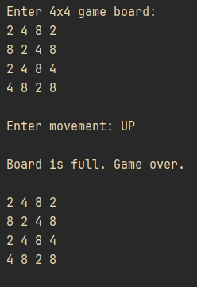
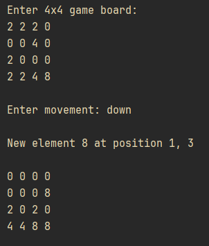

### Problem description

2048 is a single-player sliding tile puzzle video game written by Italian web developer Gabriele Cirulli and published on GitHub. The object of the game is to slide numbered tiles on a grid to combine them to create a tile with the number 2048. (Taken from Wikipedia)

This program aims to simulate a single move in the 2048 game on a 4x4 grid. The program should read the grid and a direction/movement from the user, slide all non-zero tiles as far as possible in that direction, merge tiles of the same value, and add a new tile (2 or 4) in a random empty position if any movement occurs. Finally, display the updated grid.

### Solution Explanation
This program starts by reading the 4x4 game board from user input/keyboard, then the movement (left, right, up, or down). For simplicity, the program will only check the movement input (allow only up, down, left and right) and not the game board input. The program then simulates the movement specified by the user and update the board according to the rules of the 2048 game. After applying the movement change, the program will try to add a new element, either 2 or 4, to a random empty tile on the board. If it fails to do so, meaning the board is full, the program prints a "Game over!" to tell the user no valid movements are available and the game should end here. Finally, the program displays the updated board to the user (or the original board if the game is over).

#### Methods
- `getGameBoard` and `getMovement` takes input from the user
- `left`, `right`, `up`, and `down` simulates the movement and updates the game board
- `addNewRandomElement` adds either 2 or 4 randomly to an empty tile in board
- `swap` swaps two tile on the board

#### Movements
All movements share the same rule as below:
1. Step one, shift/slide all tiles in a specific direction to clear out zeroes between non-zero tiles
2. Merge tiles with the same value in a specific direction
3. Slide all tiles again.

The sliding movement is implemented by checking if the neighbouring tile is zero and swapping two adjacent elements one at a time. The action is repeated three times because the total movement required to shift the topmost or leftmost element to the bottommost or rightmost element in a grid of 4 is at most 3 times.

### Sample input and output

Sample case 1

Sample case 2

Sample case 3

Sample case 4

Sample case 5

### Source code
See [Q6.java](Q6.java)

